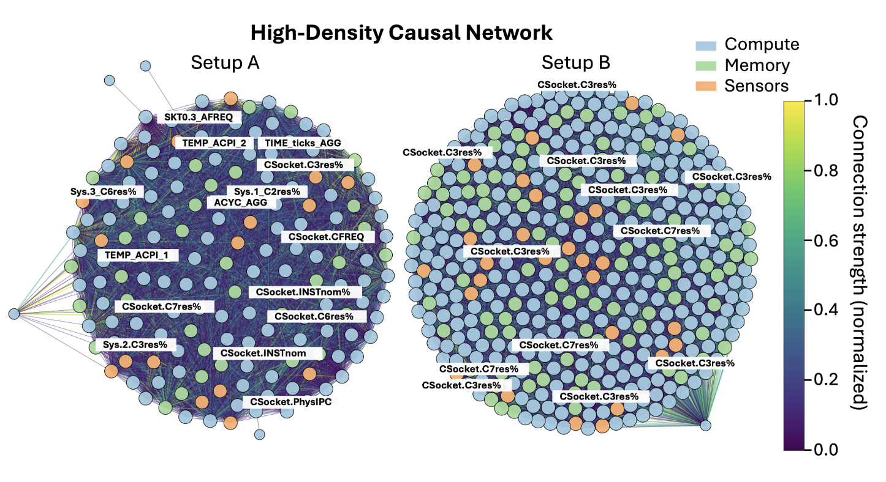

# EXACT

**EXACT** (Edge-eXplainable Autonomous Causal Telemetry) is an edge-only, causal, and explainable
anomaly detector for **silicon lifecycle management (SLM)**. This repository is a GitHub-ready,
notebook-derived package organized from:

- `EXACT.ipynb` (primary results pipeline)
- `EXACT-2-Copy1.ipynb` (**only** the *Fig. 5* benign sparse causal network visualization code)

The accompanying draft PDF is included under `docs/` for reference.



## Repository layout

```
EXACT/
  exact/                    # Python package (refactored from notebooks)
  scripts/                  # Repro scripts (CLI entrypoints)
  data/                     # Data docs + synthetic sample dataset
  docs/                     # Draft PDF + figures extracted from the draft
  notebooks/                # Cleaned notebooks (optional; see below)
  results/                  # Default output folder (gitignored)
  tests/                    # Smoke tests on synthetic sample data
```

## Install

```bash
python -m venv .venv
source .venv/bin/activate

pip install -U pip
pip install -e ".[dev]"
```

## Quickstart (runs on synthetic sample data)

```bash
python scripts/run_exact_ets2026.py       --data-root data/sample       --out-root results/sample_run
```

Outputs:
- `results/sample_run/SETUP_A_EXACT_summary_per_workload.csv`
- `results/sample_run/SETUP_B_EXACT_summary_per_workload.csv`
- `results/sample_run/figures/fig4_metrics_vs_window_size.png`
- `results/sample_run/causal/SETUP_A_feature_ranks.csv` (and setup B equivalents)
- `results/sample_run/fig5_inputs/setupA_edges.csv` (and setup B equivalents)
- `results/sample_run/figures/fig6_top15_features.png`

## Using real telemetry data

EXACT expects a folder of CSVs named like:

- `DDR4_benign_<workload>.csv`, `DDR4_DROOP_<workload>.csv`, `DDR4_RH_<workload>.csv`, `DDR4_SPECTRE_<workload>.csv`
- `DDR5_benign_<workload>.csv`, `DDR5_DROOP_<workload>.csv`, `DDR5_RH_<workload>.csv`, `DDR5_SPECTRE_<workload>.csv`

See `data/README.md` for details.

## Fig. 5 benign sparse causal network (Setup A vs Setup B)

The *Fig. 5-style* visualization comes from `EXACT-2-Copy1.ipynb` and is exposed as a standalone script.

If you already have two edge CSVs (columns: `u,v,strength[,domain_u,domain_v]`):

```bash
python scripts/plot_fig5_benign_causal_network.py       --edges-a results/sample_run/fig5_inputs/setupA_edges.csv       --edges-b results/sample_run/fig5_inputs/setupB_edges.csv       --out results/sample_run/figures/fig5_benign_sparse_causal_network.png
```

## Notes on fidelity vs. the draft

- The core scoring implementation (`exact.cintas`) matches the structure used in `EXACT.ipynb`.
- The Fig. 5 plot implementation (`exact.fig5`) is directly derived from the visualization block in
  `EXACT-2-Copy1.ipynb`.

## License

MIT (replace as needed).
